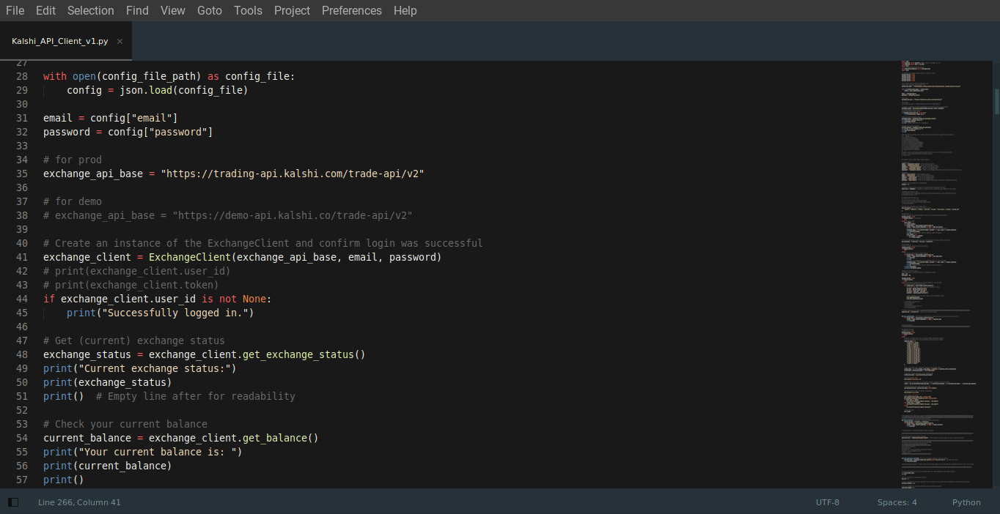
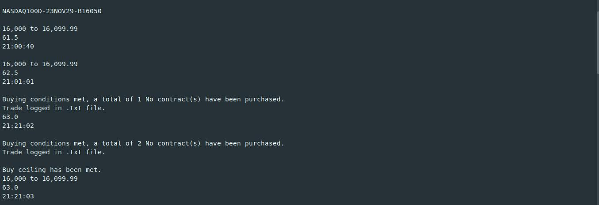
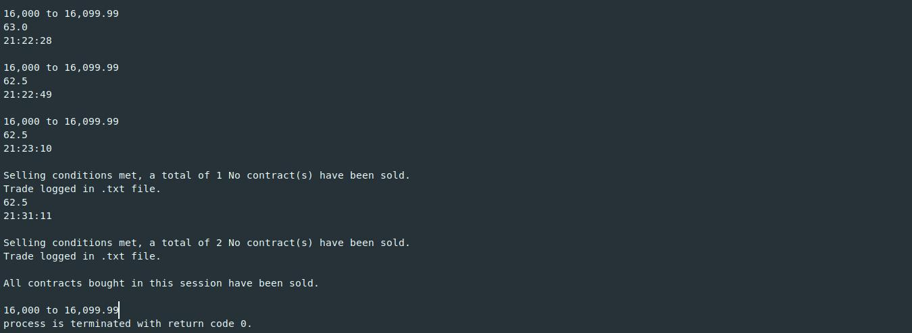
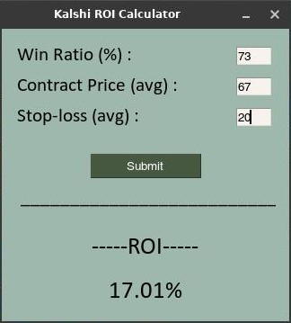

<b style="color:green;">Kalshi API Project</b>

---

This is a set of two (main) Python programs which use Kalshi's API for automated trading. The trading scripts do not use the Kalshi-python SDK. Instead, they work solely off of API calls from the ExchangeClient class in the KalshiClientsBaseV2.py script (the one included in their starter files). The project also includes an ROI calculator I built specifically for Kalshi.

---

Capabilites of either program include:  
-Update 04/27/24: Both the 'standard' API client and the interactive version(s) now include the ability to sell contracts at a profit (i.e. "take profit" functionality).  
-Logging the user in  
-Showing the exchange status and whether trading is currently active  
-Displaying the user's portfolio balance  
-Creating orders based on time of day and price range...  
(Price is figured using (bid + ask) / 2 , AKA the "ask, bid" average)  
-Allowing the user to choose the 'yes' or 'no' side of any contract  
-Allowing the user to set the max # of contracts he/she is willing to buy in a given session  
-Allowing the user to set a 'stop-loss' price at which the program will sell contracts purchased within a session

---

  

---

Note: Neither program is able to enter the stop-loss ('sell') loop until...  
1.) max # of contracts have been bought, or  
2.) user's 'time of day' range for buying has ended.

  

  

Contracts will not be sold (in either program) all at once- instead, they are sold one by one with a short sleep interval in between.  
Buying is also executed one contract at a time and has a longer sleep period (to make sure price is staying consistent).

---

There are (obviously) differences between using the standard API client code, and the interactive version...

The interactive version will work for someone who knows nothing about code, but it comes with certain limitations. Namely, that you can only work with the S&P500 and Nasdaq100 Financial Event Markets. (That still provides a total of 10 Event Markets between the two indices - Daily, Weekly, Monthly, and Yearly (bracket) Ranges, and the Daily Up/Down for either financial index). The interactive version is completely text-prompt/input based and will run from the command line (terminal) as long as the user has Python installed and added to their system's PATH environment variable.

The standard ('Kalshi_API_Client_v1.py') has a bit more functionality, but everything must be modified from within the code. Essentially, you can use it just like the interactive version for basic algorithmic trading, but you'd be setting all the variables manually (instead of having interactive prompts). The extra functionality includes the ability to choose any Event or Market on Kalshi and to filter through the data in different ways. Adjusting the sleep time(s) between buying and selling is another extended feature that can only be set manually in this standard version.

Also, note that the interactive version will only work during normal trading hours (because the 'sell loop' end_time variable is set to stop at the end of the trading day for whatever (U.S.) time zone you choose. I realize this makes the Weekly, Monthly, and Yearly markets less tradable, but honestly, those markets are mainly included because I copied the entire standard API client code to create the interactive version. (Plus, you really don't need algorithmic trading for long term bets.) However, to take them out of the program completely would be overkill because they do still have functionality within trading hours.

---

Besides the algo trading scripts, there is a Kalshi ROI Calculator and an interactive GUI for the Calculator (made using PySimpleGUI). It will take (from the User) a win ratio (%), an (average) contract price, and an (average) stop-loss price and give you the ROI (%) based on those figures.  

  

---

Here are a couple of YouTube videos I made that show me working/trading with this Kalshi API Project software:  
https://youtu.be/Ip591Wjn2i0?si=cQYvizg9nThMy84-  
https://youtu.be/dHoq9LxrYsk?si=biZSQycicUAM_Bqx
